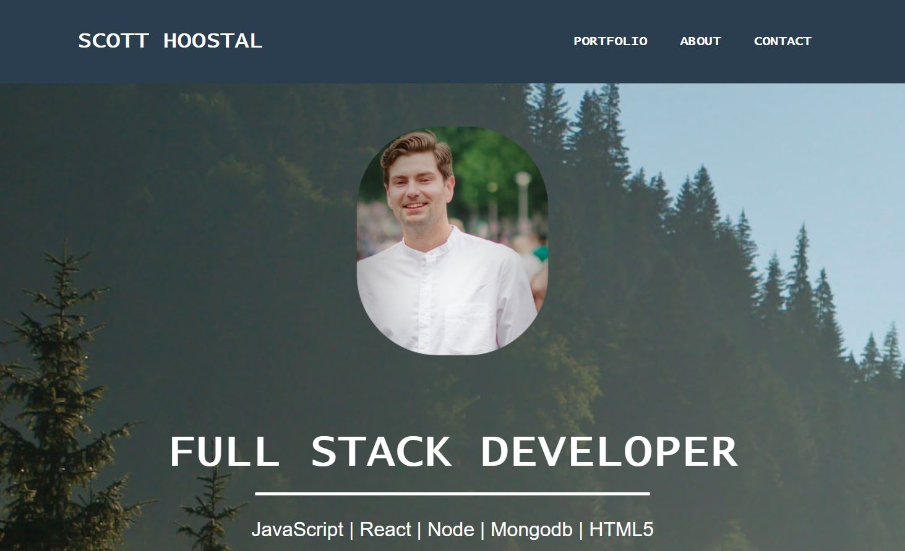

## Link to Live Application
https://500inthegraveyard.github.io/ScottPortfolio/

## Application Purpose
This is my page where I store all my links to my coding projects. I also have my resume and links to github and linked in.

## Start Application
In the root go to the html file, right click, and view in browser.

## Screenshot

